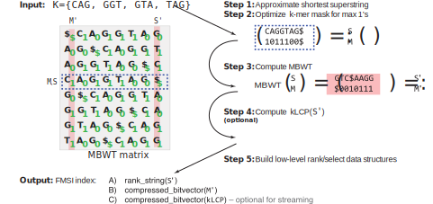

# FMSI

[](https://github.com/OndrejSladky/fmsi/actions/)

<!-- vim-markdown-toc GFM -->

* [Introduction](#introduction)
* [Installation](#installation)
* [Usage](#usage)
   * [k-mer queries (stable)](#k-mer-queries-stable)
   * [k-mer set operations (experimental)](#k-mer-set-operations-experimental)
      * [Basic: k-mer set operations managed by FMSI](#basic-k-mer-set-operations-managed-by-fmsi)
      * [Advanced: externally managed k-mer set operations](#advanced-externally-managed-k-mer-set-operations)
* [Commands overview](#commands-overview)
* [How it works?](#how-it-works)
* [Testing](#testing)
* [Issues](#issues)
* [Changelog](#changelog)
* [Licence](#licence)
* [Contact](#contact)

<!-- vim-markdown-toc -->

## Introduction

FMSI is a highly memory-efficient tool for performing membership queries on single $k$-mer sets.
FMSI uses [masked superstrings](https://doi.org/10.1101/2024.03.06.583483) for storing the $k$-mer sets to ensure high compressibility for a wide range of different $k$-mer sets,
and implements FMS-index, a simplification of the FM-index. It supports both streaming and single queries. The functionality implemented in FMSI is based on the following papers:

The memory consumption for FMSI are (w/o kLCP which is additional 1bit/superstring char):
- Queries: 2.41 bits / canonical 31-mer with human genome; ~3 bits / canonical 31-mer for _E. coli_ pangenome (1.17G k-mers from 89k genome); ~7 bits / canonical 31-mer for _SARS-CoV-2_
- Construction: 46 GB for human genome

[1] Ondřej Sladký, Pavel Veselý, and Karel Břinda: FroM Superstring to Indexing: a space-efficient index for unconstrained *k*-mer sets using the Masked Burrows-Wheeler Transform (MBWT).
*bioRxiv* 2024.10.30.621029; [doi: 10.1101/2024.10.30.621029](https://doi.org/10.1101/2024.10.30.621029).

[2] Ondřej Sladký, Pavel Veselý, and Karel Břinda: Towards Efficient *k*-Mer Set Operations via Function-Assigned Masked Superstrings.
*bioRxiv* 2024.03.06.583483, 2024. [https://doi.org/10.1101/2024.03.06.583483](https://doi.org/10.1101/2024.03.06.583483)

[3] Ondřej Sladký, Pavel Veselý, and Karel Břinda: Masked superstrings as a unified framework for textual *k*-mer set representations. *bioRxiv* 2023.02.01.526717, 2023.
[https://doi.org/10.1101/2023.02.01.526717](https://doi.org/10.1101/2023.02.01.526717)



To construct an index (the `fmsi index` subcommand), FMSI accepts as input (see the `-p` parameter) a masked superstring of the $k$-mer set.
The masked superstring can be computed by [KmerCamel🐫](https://github.com/OndrejSladky/kmercamel).
It then stores the index file in files with the same prefix and the `.fmsi.[component]` extension.
There are these components:
- `.ac_gt`, `.ac` and `.gt` for storing the nodes of the wavelet tree of BWT
- `.mask` for storing the RRR-compressed SA-transformed mask
- `.klcp` for storing the kLCP array (optional)
- `.misc` for storing counts, dollar position and k

To query the index (the `fmsi query` subcommand), FMSI accepts a text file with $k$-mers on separate lines to query (see the `-q` parameter).
In a very near future, we will however update this to accept a FASTA file and allow for streaming queries.


Additionally, FMSI experimentally supports set operations using the $f$-masked superstrings framework.
However, this feature is currently only experimental and requires rather significant time and memory.


## Installation

**Prerequisities:**

- GCC 4.8+ or equivalent
- Zlib

**Installation:**
FMSI can be installed using [bioconda](https://bioconda.github.io/):
```
conda install bioconda::fmsi
```

Alternatively, FMSI can be built directly from source:
```
git clone --recursive https://github.com/OndrejSladky/fmsi
cd fmsi && make -j
export PATH="$PATH:$(pwd)"
```

## Usage

### k-mer membership queries queries (stable)

1. Compute an optimized masked superstring for all k-mers from a given FASTA file by [KmerCamel🐫](https://github.com/OndrejSladky/kmercamel).
   ```
   kmercamel -p input_file.fa -k 31 -c -o ms-no-opt.fa
   kmercamel optimize -p ms-no-opt.fa -k 31 -c -o ms.fa
   ```

2. Create an FMS index from the masked superstring:
   ```
   fmsi index -p ms.fa -k 31
   ```

3. Query the index from a given query FASTA file with k-mers:
   ```
   fmsi query -p ms.fa -q query.fa -k 31 -O
   ```

#### Output format

For each line of queries, FMSI outputs one bitstring, where 1 corresponds to a present *k*-mer and 0 corresponds to not present *k*-mer.
Invalid *k*-mers, i.e., those that contain non-ACGT characters are also indicated with 0s.

#### Specific-case usage

If you do not need support for streaming queries, use the `-s` flag when querying for additional memory savings.

If your mask superstring does not maximizes the number of ones in the mask, omit the `-O` optimization flag for query as otherwise you might get incorrect results.
We, however, recommend to optimize the mask using `kmercamel optimize`.

### k-mer minimum perfect hash function

1. Compute a default masked superstring for all k-mers from a given FASTA file by [KmerCamel🐫](https://github.com/OndrejSladky/kmercamel).
   ```
   kmercamel -p input_file.fa -k 31 -c -o ms.fa
   ```

2. Create an FMS index from the masked superstring:
   ```
   fmsi index -p ms.fa -k 31
   ```

3. Query the index from a given query FASTA file with k-mers:
   ```
   fmsi query -p ms.fa -q query.fa -k 31 -H
   ```


### k-mer set operations (experimental)

#### Basic: k-mer set operations managed by FMSI

If you wish to perform set operations or answer membership queries without the
need to understand the details of the $f$-masked superstring framework, FMSI
can manage the details for you.

This can be done in a few simple steps:

1. **Compute a masked superstring.**
   - This can be done by [KmerCamel🐫](https://github.com/OndrejSladky/kmercamel); simply run `kmercamel -c -k 31 -p fasta.fa -o ms.fa` (with appropriate values for `-k` and `-p`).
   - If you obtained the masked superstring in a different way, make sure it minimizes the number of ones; if you're unsure, you can use `kmercamel optimize -c -a zeros -k 31 -p ms_more_ones.fa -o ms.fa`. No need to optimize superstrings directly computed by KmerCamel🐫.
2. **Index the masked superstring** with `fmsi index -p ms.fa`.
3. **Perform the set operations** you wish with `fmsi [operation] -k 31 -p ms1.fa -p ms2.fa -r ms.fa`. Possible operations (use the names instead of `[operation]`) are:
   - `union` to compute the union.
   - `inter` to compute the intersection
   - `diff` to compute the set difference
   - `symdiff` to compute the symmetric difference
4. **Query the index** with `fmsi query -p ms.fa -q query.fa -k 31`.
5. To **get back the underlying masked superstring**, use `fmsi export -p ms.fa`.

If you use FMSI this way, it ensures that operations in any order and queries to any index are computed correctly,
while keeping the memory usage for queries as low as possible. Furthermore, exported $f$-masked superstrings are always,
or-masked superstrings, which are the default masked superstrings.

The only downside to this approach is that each set operation uses compaction, which is the most time- and memory- consuming
part of the process, which in some use cases might cause slowdowns which are not necessary. If this is your case,
you probably want to stick to the advanced usage, managing the functions and building block methods yourself.

#### Advanced: externally managed k-mer set operations

If you wish to manage the operations yourself, the workflow is quite similar to the basic usage, with the following changes:
- Underlying $f$-MS concatenation can be done with `fmsi merge`. Details on which $f$ should be used is described in Chapter 4 of the [paper](https://doi.org/10.1101/2024.03.06.583483).
- Compaction and change back to the or-masked superstring can be done with `fmsi compact`.
- If you query the index with different function than or, use the `-f` argument. The same applies to compaction.

## Commands overview

To run the tool, run `fmsi [command]`

The recognized commands are:

- `index` Creates a BWT based index of the given masked superstring.
- `query` Queries a $k$-mer against an index.
- `export` Export the underlying masked superstring.
- `union` Performs union on two indexes. Expects or-MS.
- `inter` Performs intersection on two indexes. Expects or-MS.
- `diff`  Performs set difference on two indexes. Expects or-MS.
- `symdiff` Performs symmetric difference on two indexes. Expects or-MS.
- `merge` Merge several indexes.
- `compact` Compacts an index.


Each command has its own set of arguments, which can be displayed by running `fmsi [command] -h`.

## How it works?

FMSI builds on the representation of *k*-mer sets via [masked superstrings](https://doi.org/10.1101/2024.03.06.583483),
which ensures a generally compact representation of *k*-mers, requiring typically 1-1.4 characters per *k*-mer for genomes and pan-genomes.

FMSI then builds a simplified FM-index, which omits the sampled suffix array, which is the key to the memory efficiency.
It instead computes the SA-transformed mask, which makes it possible to determine the presence of a *k*-mer
without the need to compute the original coordinates.

Additionally, FMSI optionally constructs the kLCP array (a binary version of the truncated LCP array) 
to allow *O(1)* time for a *k*-mer in streaming queries.


The memory consumption of the index is split as follows:
- $2.125$ bits per superstring character to store the BWT ($2.125 - 3$ bits per *k*-mer for typical genomes and pan-genomes).
- Typically $0 - 0.8$ bits per *k*-mer to store the SA-transformed mask.
- Optionally $1$ bit per superstring character to store the kLCP array.

- $1$ byte per character of the largest entry in the queried fasta file (which is typically negligible).

The construction of the index requires the full suffix array to be computed and requires up to 17 bytes per superstring character.


## Testing

To run the associated tests, simply run `make test`.

## Issues

Please use [GitHub issues](https://github.com/OndrejSladky/fmsi/issues).

## Changelog

See [Releases](https://github.com/OndrejSladky/fmsi/releases).


## Licence

[MIT](https://github.com/OndrejSladky/fmsi/blob/master/LICENSE.txt)

## Citation

> Ondřej Sladký, Pavel Veselý, Karel Břinda:
**"FroM Superstring to Indexing: a space-efficient index for unconstrained *k*-mer sets using the Masked Burrows-Wheeler Transform (MBWT)"**, *bioRxiv* 2024.10.30.621029; [doi: 10.1101/2024.10.30.621029](https://doi.org/10.1101/2024.10.30.621029).

```
@article {Sladky2024.10.30.621029,
	author = {Sladk{\'y}, Ond{\v r}ej and Vesel{\'y}, Pavel and B{\v r}inda, Karel},
	title = {FroM Superstring to Indexing: a space-efficient index for unconstrained k-mer sets using the Masked Burrows-Wheeler Transform (MBWT)},
	elocation-id = {2024.10.30.621029},
	year = {2024},
	doi = {10.1101/2024.10.30.621029},
	publisher = {Cold Spring Harbor Laboratory},
	URL = {https://www.biorxiv.org/content/early/2024/11/03/2024.10.30.621029},
	eprint = {https://www.biorxiv.org/content/early/2024/11/03/2024.10.30.621029.full.pdf},
	journal = {bioRxiv}
}
```

## Contact

[Ondrej Sladky](https://iuuk.mff.cuni.cz/~sladky/) \<ondra.sladky@gmail.com\>\

